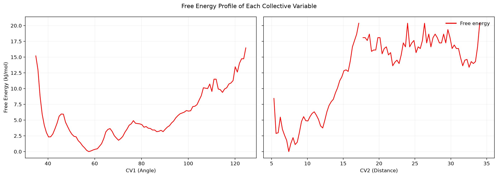
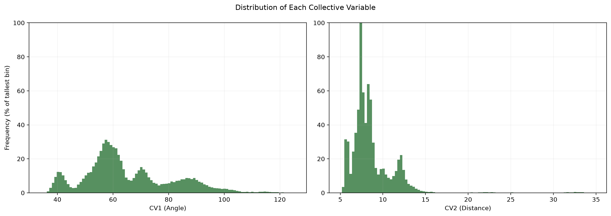
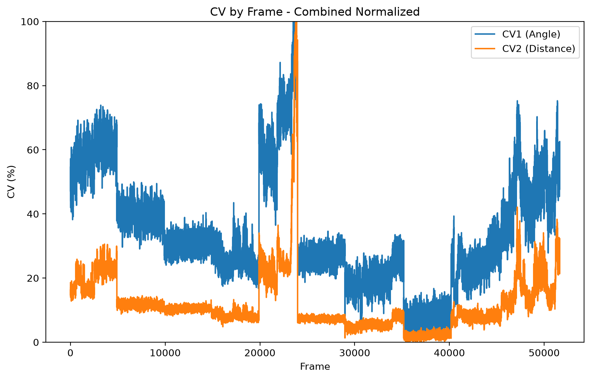
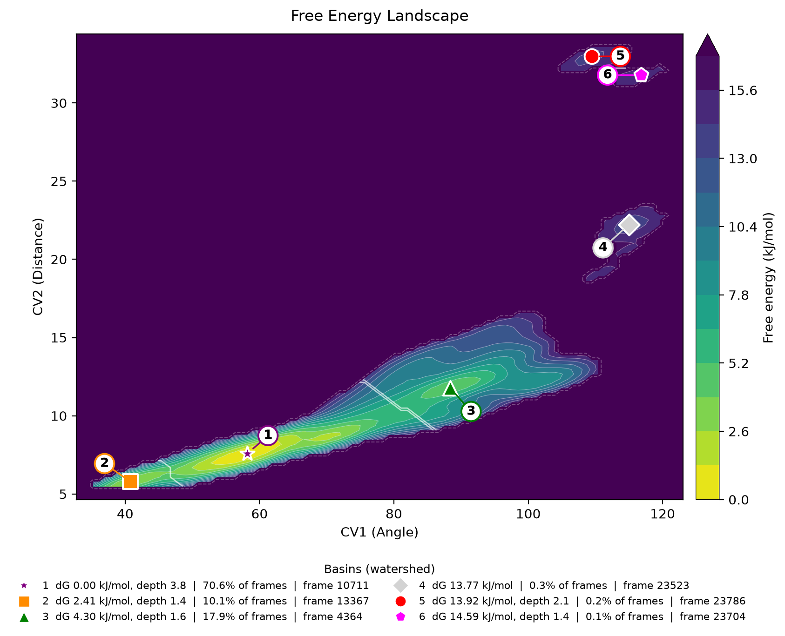
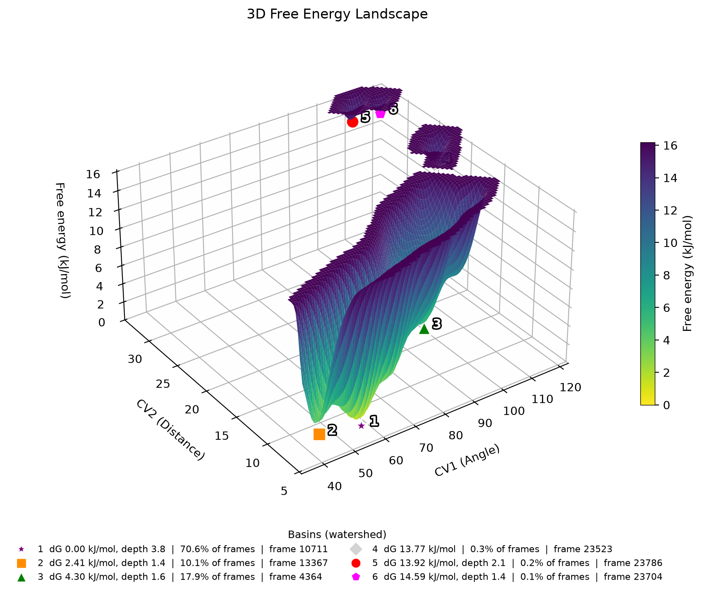
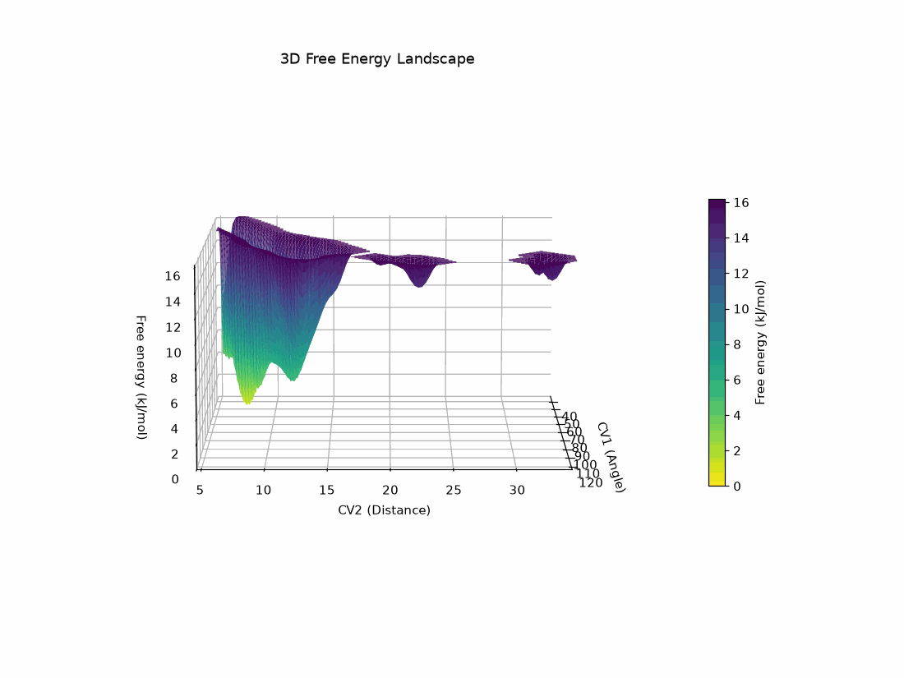

[](https://doi.org/10.5281/zenodo.10850229)

# Free Energy Landscape Analysis

Builds the free energy landscape of a molecular dynamics simulation from two collective variables,
finds its metastable states, and gives you a representative frame for each one.

Input is two text files of `frame value`. Output is five figures, an animation and two tables.

## Install

```bash
pip install free-energy-landscape
```

## Usage

```bash
free_energy_landscape cv1.txt cv2.txt --names "CV1 (Angle)" "CV2 (Distance)"
```

Every figure below was produced by that same command run on the two files in `inputs/`:

```bash
free_energy_landscape inputs/proj1Out.txt inputs/proj2Out.txt --names "CV1 (Angle)" "CV2 (Distance)"
```

Everything else is default. The run is deterministic — no seed, no `k`, no initialisation — so the
same input gives byte-identical output on any machine and for any number of cores.

Each CV file is two columns, frame index and CV value. Both must describe the same trajectory: same
number of rows, same frame index on every row. See [docs/OPTIONS.md](docs/OPTIONS.md) for every
command-line flag.

## Theoretical background

The free energy landscape is a conceptual and computational tool used to understand the energetics
and dynamics of molecular systems. It is particularly useful for interpreting molecular dynamics
simulations, where it condenses a trajectory of millions of coordinates into the energetics of the
processes the system actually undergoes: protein folding, chemical reactions, and phase transitions.

Collective variables (CVs) are the coordinates that make this possible. They reduce the full set of
atomic coordinates to the few degrees of freedom that matter — a principal component, a distance, an
angle, a dihedral — so the state of the system can be described by a handful of numbers.

## How it works

**1. Density.** A Gaussian kernel density estimate turns the frames, one point each in the 2D CV
space, into a smooth probability density $\hat{f}$ on a regular grid. One kernel is fitted over the
whole trajectory; parallelism splits only its evaluation.

**2. Free energy.** Boltzmann inversion, shifted so the global minimum sits at zero:

$$G = -k_B T \ln \hat{f}, \qquad G \leftarrow G - \min G$$

**3. Sampling mask.** A kernel estimate returns a number even where no frame exists, and that number
is extrapolation, not measurement. A cell counts as sampled only when the estimate expects at least
one frame inside it; the rest is left out of the analysis and of the colour scale.

**4. Steepest descent.** Each cell points at its lowest neighbour among the eight surrounding it, or
at itself if none is lower. Following those pointers to their fixed point gives the local minimum
each cell drains into — its **basin of attraction**, which is the operational definition of a
metastable state.

**5. Saddles.** Neighbouring basins meet along a ridge. The saddle between them is the lowest point
of that ridge, the cheapest way across:

$$\text{saddle}(A,B) = \min_{\substack{x \in A,\ y \in B \\ x,\,y \text{ adjacent}}} \max\big(G(x),\,G(y)\big)$$

**6. Depth.** How far a basin must climb to escape — its topological persistence:

$$\text{depth}(A) = \min_B \text{saddle}(A,B)\ -\ \min_{x \in A} G(x)$$

**7. Merging.** Basins shallower than the cut are absorbed by the neighbour across their lowest
saddle. The cut is chosen at the largest step in the sorted depths, where real structure and
estimator ripple separate, and never exceeds $k_B T$. What it chose and what it merged is printed
on every run.

**8. Representatives.** Each frame inherits the basin of its cell. The representative of a basin is
the frame of lowest free energy inside it — an actual conformation, ready to extract from the
trajectory.

Full derivation, a worked one-dimensional example, and why DBSCAN is not used:
[docs/METHOD.md](docs/METHOD.md).

## Figures

### 1. Free energy profile of each CV



Boltzmann inversion of the 1D histogram of each collective variable, on a shared energy axis. Minima
are the preferred values of that CV; the rise between them is the barrier along that coordinate
alone.

### 2. Distribution of each CV



How often each CV value occurs, on the same axes as Figure 1 and scaled so the tallest bin across
both variables is 100%. These are the raw counts that Figure 1 turns into energy.

### 3. CVs against frame



Both CVs over the trajectory, rescaled to a common 0–100 axis. Shows when transitions happen and
whether the sampling is converged.

### 4. Free energy landscape



The two CVs combined. Bright is low energy, dark is high; the region beyond the dashed line was
never sampled, so no energy is claimed there. White lines are the watershed ridges separating
basins, and each numbered callout marks a basin minimum. The legend gives its depth, its share of
the trajectory, and its representative frame.

### 5. Landscape in three dimensions



The same surface as relief, which makes the depth of each basin and the height of the barriers
between them directly readable.

### 6. Rotating view



The 3D surface across a full rotation, so features hidden behind a ridge from one angle become
visible from another.

## Tables

`basins.tsv` — one row per metastable state:

```
  #        CV1        CV2       dG    depth   frames    pop%  rep frame
-----------------------------------------------------------------------
  1     58.181      7.578     0.00     3.82    36447   70.58      10711
  2     40.777      5.786     2.41     1.41     5201   10.07      13367
  3     88.408     11.761     4.30     1.59     9263   17.94       4364
  4    114.971     22.219    13.77        -      164    0.32      23523
  5    109.475     32.975    13.92     2.10       98    0.19      23786
  6    116.803     31.780    14.59     1.43       43    0.08      23704
```

**dG** is the basin minimum relative to the global minimum, **depth** how far it must climb to reach
a neighbour, **pop%** its share of the trajectory, and **rep frame** the conformation to extract. A
dash under depth means the basin has no neighbour: it sits on its own island of sampled space.

`discrete_values_energy_frames.tsv` — every frame with its energy and basin id, sorted by energy.

## Documentation

- [docs/METHOD.md](docs/METHOD.md) — the method in full, with a worked example and the reasoning
  behind each choice
- [docs/OPTIONS.md](docs/OPTIONS.md) — every command-line flag, input format, output files
- [CHANGELOG.md](CHANGELOG.md) — what changed in 2.0.0 and why results differ from 1.x

## Citation

[10.5281/zenodo.10850229](https://doi.org/10.5281/zenodo.10850229)
